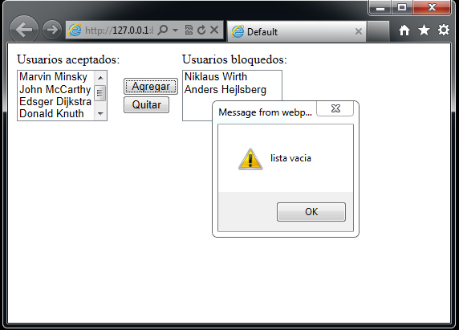
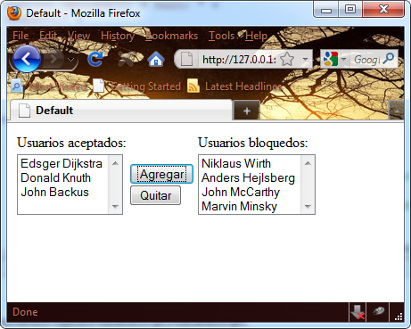
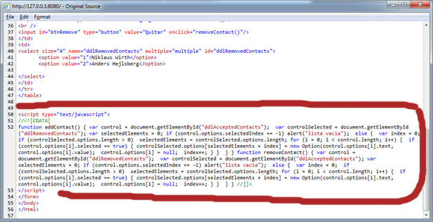

# Utilizando JavaScript desde código ASP.NET

Actualmente es difícil construir una aplicación ASP.NET que no haga uso de las capacidades de JavaScript para realizar operaciones del lado del cliente o browser, operaciones que si fueran desarrolladas en su totalidad con la arquitectura ASP.NET serian demasiado costosas, basta recordar que ASP.NET es una arquitectura totalmente hecha para su uso del lado del servidor, por lo que hace uso de un mecanismo de Postback o de ida y vuelta entre los datos de la página solicitada por el cliente y por el servidor que proporciono la página, por lo que el mecanismo de Postback hace uso de uno de los recursos más valiosos de una red: el ancho de banda.

Durante ese viaje pueden ocurrir eventos que retarden o interrumpan la respuesta del servidor, causando una pérdida o una retrasmisión de los datos por parte del usuario resultando en una forma ineficiente de comunicación ya que ASP.NET reconstruye la página completa con todo su contenido en cada solicitud.

Para ayudar a no utilizar con frecuencia este mecanismo, hay que utilizar JavaScript en el cliente o browser como un complemento a las operaciones ASP.NET. Para utilizar JavaScript junto a ASP .NET, existe la clase ClientScriptManager la cual se programa mediante la propiedad ClientScript de la clase Page, la cual expone métodos que permiten incrustar código JavaScript dentro de la página ASP.NET.

Los métodos más comunes usados de esta clase son:
<ol>
<li><b>RegisterClientScriptBlock:</b> Incrusta el código JavaScript al inicio del formulario después de la etiqueta
, genera dinámicamente el código JavaScript desde una cadena.</li>
<li><b>RegisterStartupScript:</b> Incrusta el código JavaScript en el final de la página, antes del cierre del formulario o sea antes del cierre de la etiqueta , por lo que se recomienda para operaciones con controles HTML o ASP.NET, ya que hace referencia a ellos una vez cargados.</li>
<li><b>RegisterClientScriptInclude:</b> sirve para ejecutar el código JavaScript que se guarda en un archivo externo (comúnmente con extensión .js) tiene dos cadenas como argumentos un nombre para identificar el script y el archivo que contiene el código JavaScript.
</li>
</ol>
Como ejemplo mostraremos una página ASP.NET que utiliza dos listas de usuarios (ListBox) y dos botones (HTML input) que se utilizan para mover los usuarios de una lista hacia otra. Los eventos son controlados mediante código JavaScript, esto sin utilizar código JavaScript incrustado en la página HTML, sino que el código JavaScript se genera desde código ASP.NET.

Primero creamos el código JavaScript que tendra la funcionalidad para agregar los elementos de una lista hacia la otra, esto se logra con la función FuncCopyItem(string name, string source, string destiny) esta función recibe tres argumentos el nombre de la función JavaScript que se creará en el código HTML al solicitar la página y con la cuál se identificaran los eventos de los controles , el control ListBox fuente de donde inicialmente se tomarán los items y por último el control ListBox destino a donde se pondrán los items. Con la siguiente línea de código:

<pre>
    ClientScriptManager cs = Page.ClientScript;
 </pre>

Obtenemos el objeto ClientScriptManager de la página, con él cual utilizaremos el metódo cs.RegisterStartupScript con sus parámetros correspondientes, algo importante por lo cuál usamos este metódo es por que para construir el código JavaScript utilizamos la propiedad ClientID del control ListBox, es decir el control debe existir obligatoriamente de lo contrario, cuando ASP .NET contruya la página contruirá el código JavaScript con estos parámetros nulos lo que causará un error no en la página ASP.NET sino en el código JavaScript cuando se llame para ejecutarse.

Fig 1 Ejecutando la aplicación ASP.NET en Internet Explorer 9.0

Fig 2 Ejecutando la aplicación ASP.NET en Firefox.

Fig 3 Mostrado el código JavaScript en la página generada por ASP.NET.

